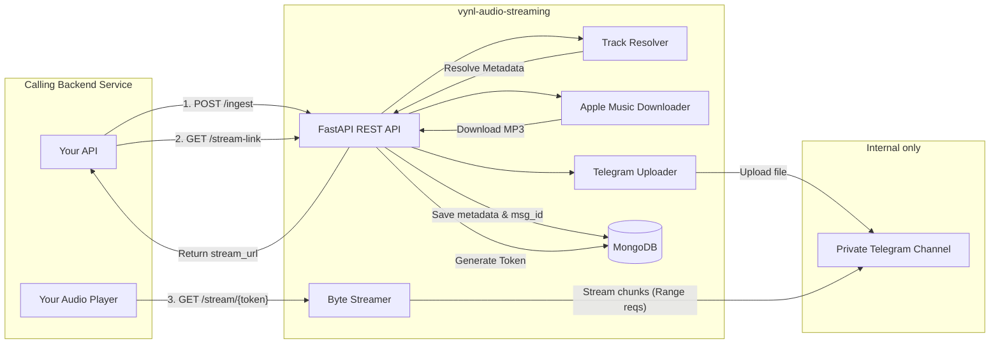

# VYNL Audio Streaming Microservice — Architecture

**Pure backend service.** No frontend, no user UI, no public Telegram bot. Only other backend services call this API.

## 1. What This Service Does

A **backend-only** microservice (FastAPI) that other services talk to over HTTP to resolve, download, store, and stream audio securely.

1. **Resolve** — calling service sends **song name** (+ optional artist) → we return an **Apple Music link**
2. **Download** — fetch `.mp3` from Apple Music (via aplmate.com)
3. **Store** in a private Telegram channel (for unlimited free storage bandwidth)
4. **Return temp stream URLs** (2 hr TTL) for playback via an optimized ByteStreamer
5. **Regenerate** links when they expire

### Who interacts with what

| Actor | Interaction |
|-------|-------------|
| **Calling backend service** | `GET /search`, `POST /resolve`, `POST /ingest`, `GET /stream-link` |
| **Calling service's player** | `GET /stream/{token}/{name}.mp3` (direct HTTP, supports Range/seek) |
| **End user** | Never touches VYNL directly — only through the calling service |
| **Telegram** | Internal storage only — not a user-facing bot |

### Typical Calling-Service Flow

```text
1. User picks a song in YOUR app
2. YOUR backend → GET vynl /api/v1/tracks/search?title=...
3. VYNL returns candidates
4. YOUR backend → POST vynl /api/v1/tracks/ingest { title, artist, apple_music_url }
5. VYNL dedups OR downloads, stores in Telegram → returns { track_id }
6. YOUR backend → GET vynl /api/v1/tracks/{track_id}/stream-link
7. VYNL returns { stream_url, expires_at }
8. YOUR player plays stream_url directly
9. Link expires → request new stream-link (step 6)
```

---

## 2. Architecture Diagram



---

## 3. Storage & Database Schema

### MongoDB: `tracks` Collection
Stores song metadata and its location in the Telegram channel.

```json
{
  "_id": "ObjectId",
  "track_id": "uuid-v4",
  "apple_track_id": 123456789,
  "apple_music_url": "...",
  "title": "Song Title",
  "artist": "Artist Name",
  "filename": "Song - Artist.mp3",
  "file_size": 5000000,
  "duration_ms": 210000,
  "artwork_url": "...",
  "telegram": {
    "chat_id": -100123456789,
    "msg_id": 42,
    "file_id": "AgADBA..."
  },
  "status": "stored",
  "created_at": "datetime",
  "updated_at": "datetime"
}
```

### MongoDB: `stream_tokens` Collection
Stores time-limited tokens to secure playback.

```json
{
  "_id": "ObjectId",
  "token": "secure-url-safe-token",
  "track_id": "uuid-v4",
  "created_at": "datetime",
  "expires_at": "datetime" 
}
```
*Note: Uses a TTL index on `expires_at` for automatic cleanup.*

---

## 4. Components & Modules

- **`app.services.track_resolver`**: Uses iTunes Search API to resolve metadata and get the direct Apple Music URL.
- **`app.services.apple_downloader`**: Uses `aplmate_client` to communicate with the aplmate.com API to bypass Apple Music DRM and download the direct mp3.
- **`app.services.telegram_uploader`**: Uses `wzgram` (a fast Pyrogram fork) to upload the downloaded MP3 to the private Telegram channel and extract the `file_id`.
- **`app.services.streamer`**: A memory-optimized `ByteStreamer`. Instead of downloading the file to RAM when a stream is requested, it uses Pyrogram's `stream_media` with calculated chunk offsets. This allows instant seeking/Range-requests with minimal server overhead.
