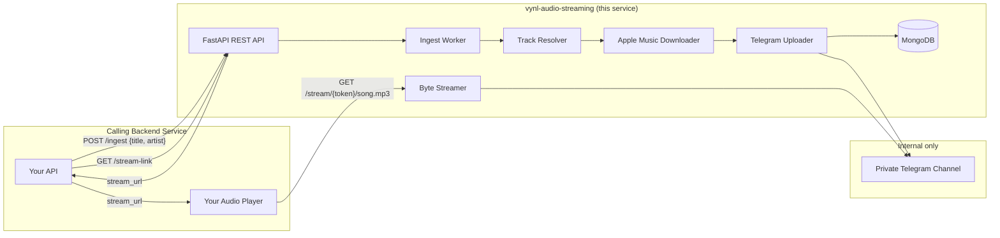

# VYNL Audio Streaming Microservice — Plan

**Pure backend service.** No frontend, no user UI, no public Telegram bot. Only other backend services call this API. The calling service receives a temp stream URL and plays audio from that link directly.

Plan for `vynl-audio-streaming`, built from two reference codebases:

| Source | Role |
|--------|------|
| `D:\Projects\Apple-Music-Bot-main` | Download `.mp3` from Apple Music (via aplmate.com) |
| `D:\FalixMovies FULLSTACK\falix-backend-main` | Telegram private-channel storage + byte-range streaming |

---

## 1. What We're Building

A **backend-only** microservice (FastAPI) that other services talk to over HTTP:

1. **Ingests** audio — calling service sends **song name** (+ optional artist) → we resolve, download, store
2. **Stores** in a private Telegram channel (Falix-style) — invisible to end users
3. **Returns temp stream URLs** (1–2 hr TTL) — calling service uses this URL in its own player
4. **Regenerates** a new link on request when the old one expires

The MP3 stays in Telegram permanently. Only the **stream URL** is temporary.

### Who interacts with what

| Actor | Interaction |
|-------|-------------|
| **Calling backend service** | `POST /ingest`, `GET /stream-link` (API key) |
| **Calling service's player** | `GET /stream/{token}/{name}.mp3` (direct HTTP, supports Range/seek) |
| **End user** | Never touches VYNL directly — only through the calling service |
| **Telegram** | Internal storage only — not a user-facing bot |

### Typical calling-service flow

```
1. User picks a song in YOUR app
2. YOUR backend → POST vynl /api/v1/tracks/ingest { title, artist }
3. VYNL returns { track_id, ... }
4. YOUR backend → GET vynl /api/v1/tracks/{track_id}/stream-link
5. VYNL returns { stream_url, expires_at }
6. YOUR backend passes stream_url to YOUR frontend/player
7. Player plays: <audio src="stream_url"> or native audio SDK
8. Link dies after 1–2 hr → YOUR backend requests a new one (step 4)
```

---

## 2. High-Level Architecture



---

## 3. What We Reuse From Each Repo

### From Apple Music Bot (`ap.py` + download helpers)

| Piece | Purpose |
|-------|---------|
| `init_session()` | Session with aplmate.com |
| `get_token()` | Turnstile/userverify token |
| `get_all_track_forms()` | Parse album/playlist/track |
| `get_links_for_track()` | Resolve CDN MP3 URL |
| `download_file()` | Stream download to disk |
| `clean_song_name()` | Normalize title/filename |

**Flow:** Apple Music URL → aplmate token → track forms → CDN link → local `.mp3` (+ optional cover art).

### From Falix Backend

| Piece | Purpose |
|-------|---------|
| `ByteStreamer` | Range-aware streaming from Telegram DC |
| `encode_string` / `decode_string` | Encode `{chat_id, msg_id, hash}` |
| Pyrogram multi-client setup | Load balancing across bot tokens |
| Channel listener pattern | Detect uploads in `AUTH_CHANNEL` |

**Falix gap:** `/dl/{id}/{name}` links are **permanent**. We add a **token layer with TTL** on top.

**Apple Music Bot gap:** Ingestion only accepts `music.apple.com` URLs today. We add a **track resolver** so callers can pass a song name instead.

---

## 4. Song Name → Apple Music URL (Resolver)

The downloader (`ap.py`) needs an Apple Music link. Callers will send a **song name**, not a URL. We resolve it first.

### Recommended: iTunes Search API (free, no API key)

```
GET https://itunes.apple.com/search
  ?term={artist}+{song_title}
  &entity=song
  &limit=5
  &country=US
```

Returns JSON with `trackViewUrl`, `trackName`, `artistName`, `trackId`, `trackTimeMillis`, `artworkUrl100`.

Example response field:

```json
{
  "trackName": "Blinding Lights",
  "artistName": "The Weeknd",
  "trackViewUrl": "https://music.apple.com/us/album/...",
  "trackId": 1499378106
}
```

That `trackViewUrl` (or a constructed `https://music.apple.com/song/id{trackId}`) feeds directly into the existing `ap.py` pipeline.

### Matching strategy

| Input | Behavior |
|-------|----------|
| `{ "title": "Blinding Lights", "artist": "The Weeknd" }` | Search `The Weeknd Blinding Lights`, pick best match |
| `{ "title": "Blinding Lights" }` | Search title only; may be ambiguous |
| `{ "query": "Blinding Lights The Weeknd" }` | Single free-text string |

**Scoring (pick best result):**

1. Exact title match (case-insensitive)
2. Exact artist match if artist was provided
3. Prefer shorter duration delta if metadata available
4. Fallback: first result

### Ambiguity handling

If multiple close matches exist, two options:

- **Auto mode (default):** pick top scored match, return it in response so caller can verify
- **Strict mode:** return `409` with `candidates[]` and require a second call with `apple_track_id` or `trackViewUrl`

### Dedup key

Use `trackId` from iTunes (same as Apple Music catalog ID) as `apple_track_id` for dedup — not the raw song name string.

### Optional: direct URL still supported

Keep URL ingest as a fallback for playlists/albums or when the caller already has the link:

```json
{ "url": "https://music.apple.com/..." }
```

---

## 5. Core Flows

### Flow A — Ingest (search + download + store)

```
POST /api/v1/tracks/ingest
Body: { "title": "Blinding Lights", "artist": "The Weeknd" }
```

1. Build search query from `title` + optional `artist`
2. Call iTunes Search API → get `trackViewUrl` + `trackId`
3. Check dedup by `apple_track_id` — if exists, return existing `track_id`
4. Run `ap.py` flow with resolved URL → download MP3 to temp dir
5. Upload to private channel via Pyrogram `send_audio()`
6. Capture `chat_id`, `msg_id`, `file_unique_id[:6]` (hash)
7. Save track record in MongoDB
8. Return:

```json
{
  "track_id": "uuid",
  "title": "Blinding Lights",
  "artist": "The Weeknd",
  "apple_track_id": 1499378106,
  "resolved_url": "https://music.apple.com/...",
  "status": "stored"
}
```

**Dedup:** Same `apple_track_id` → skip re-download, return existing `track_id` (even if song name spelling differed).

### Flow B — Issue temp stream link

```
GET /api/v1/tracks/{track_id}/stream-link
Header: X-API-Key: <service-key>
Query: ttl=7200  (optional, default 1–2 hr)
```

1. Authenticate calling service (API key)
2. Look up track → get Telegram refs
3. Generate random token (e.g. `secrets.token_urlsafe(32)`)
4. Store in DB/Redis: `{ token, track_id, expires_at, created_at }`
5. Return:

```json
{
  "stream_url": "https://vynl.example.com/stream/{token}/song-name.mp3",
  "expires_at": "2026-08-09T20:14:00Z",
  "ttl_seconds": 7200
}
```

### Flow C — Stream (play audio)

```
GET /stream/{token}/{filename}.mp3
Header: Range: bytes=0-  (optional)
```

1. Look up token → reject **410 Gone** if expired/missing
2. Resolve track → decode `{chat_id, msg_id, hash}`
3. Verify hash matches file (same as Falix)
4. Stream via `ByteStreamer` with `Content-Type: audio/mpeg`, `Accept-Ranges: bytes`, **206** for range requests
5. Do **not** delete the Telegram file — only the token expires

### Flow D — Regenerate link

Same as Flow B. Calling service hits `/stream-link` again → new token, new expiry. Old tokens remain invalid after expiry (background cleanup optional).

---

## 6. Suggested Project Structure

```
vynl-audio-streaming/
├── app/
│   ├── main.py                 # FastAPI entry
│   ├── config.py               # env vars
│   ├── api/
│   │   ├── tracks.py           # ingest, stream-link, track info
│   │   └── stream.py           # GET /stream/{token}/{name}
│   ├── services/
│   │   ├── track_resolver.py   # song name → Apple Music URL (iTunes Search)
│   │   ├── apple_downloader.py # ported from ap.py + apple.py
│   │   ├── telegram_storage.py # upload to channel
│   │   ├── token_service.py    # create/validate/expiry
│   │   └── streamer.py         # ByteStreamer wrapper
│   ├── models/
│   │   ├── track.py
│   │   └── stream_token.py
│   └── db/
│       └── mongodb.py
├── requirements.txt
├── Dockerfile
├── .env.example
└── README.md
```

---

## 7. Database Schema (MongoDB)

### `tracks` collection

```json
{
  "_id": "ObjectId",
  "track_id": "uuid-or-cuid",
  "search_query": "Blinding Lights The Weeknd",
  "resolved_url": "https://music.apple.com/...",
  "apple_track_id": "1234567890",
  "title": "Song Name",
  "artist": "Artist Name",
  "filename": "Song Name.mp3",
  "file_size": 5242880,
  "duration_sec": 210,
  "thumbnail_url": "...",
  "telegram": {
    "chat_id": "1234567890",
    "msg_id": 42,
    "hash": "abc123",
    "encoded_id": "base62-compressed-id"
  },
  "status": "stored | failed | processing",
  "created_at": "ISO8601",
  "updated_at": "ISO8601"
}
```

Indexes: `track_id` (unique), `apple_track_id` (unique), `status`

### `stream_tokens` collection

```json
{
  "token": "random-url-safe-string",
  "track_id": "uuid",
  "expires_at": "ISO8601",
  "created_at": "ISO8601",
  "requested_by": "service-name-or-api-key-id"
}
```

Indexes: `token` (unique), TTL index on `expires_at` (auto-delete expired tokens)

**Optional:** Redis instead of Mongo TTL for hot token lookups.

---

## 8. API Surface (backend-to-backend only)

All `/api/v1/*` routes require `X-API-Key`. The stream endpoint uses the token as auth (no API key — URL is the secret).

| Method | Endpoint | Auth | Called by | Description |
|--------|----------|------|-----------|-------------|
| `POST` | `/api/v1/tracks/ingest` | API key | Your backend | Resolve song name → download + store |
| `GET` | `/api/v1/tracks/search` | API key | Your backend | Preview matches before ingest (optional) |
| `GET` | `/api/v1/tracks/{track_id}` | API key | Your backend | Track metadata |
| `GET` | `/api/v1/tracks/{track_id}/stream-link` | API key | Your backend | Issue temp playable URL |
| `GET` | `/stream/{token}/{name}` | Token in URL | Your player | Stream MP3 (Range/seek supported) |
| `GET` | `/health` | None | Infra/monitoring | Health check |

**Stream link response (what your service uses to play):**

```json
{
  "stream_url": "https://vynl.example.com/stream/abc123xyz/Blinding-Lights.mp3",
  "expires_at": "2026-08-09T20:14:00Z",
  "ttl_seconds": 7200
}
```

Your player hits `stream_url` directly — standard HTTP audio stream, works with HTML5 `<audio>`, ExoPlayer, AVPlayer, etc.

**Ingest request body (primary):**

```json
{ "title": "Blinding Lights", "artist": "The Weeknd" }
```

**Ingest request body (fallback — URL):**

```json
{ "url": "https://music.apple.com/..." }
```

---

## 9. Environment Variables

```env
# Telegram
API_ID=
API_HASH=
BOT_TOKEN=
STORAGE_CHANNEL_ID=-100xxxxxxxxxx    # private channel
MULTI_TOKEN1=                        # optional extra bots for streaming load

# Database
MONGO_URI=
MONGO_DB=vynl_audio

# Track resolution
ITUNES_SEARCH_COUNTRY=US             # region for Apple Music catalog matching

# Server
BASE_URL=https://vynl.yourdomain.com
PORT=8000
STREAM_TOKEN_TTL=7200                # seconds (1-2 hr)

# Security
API_KEYS=key1,key2                   # calling services
SECRET_KEY=                          # if signing tokens with JWT instead
```

---

## 10. Implementation Phases

### Phase 1 — Foundation (Week 1)

- [ ] FastAPI skeleton + config + MongoDB
- [ ] `track_resolver.py` — iTunes Search API (song name → Apple Music URL)
- [ ] Port `ap.py` downloader into `apple_downloader.py`
- [ ] Telegram upload to private channel
- [ ] `tracks` CRUD + ingest endpoint (title + artist)
- [ ] Basic health check

### Phase 2 — Streaming (Week 1–2)

- [ ] Port `ByteStreamer` + Pyrogram multi-client setup
- [ ] `GET /stream/{token}/{name}` with range support
- [ ] Token service + TTL index
- [ ] `GET /tracks/{id}/stream-link` endpoint

### Phase 3 — Production Hardening (Week 2)

- [ ] API key auth middleware
- [ ] Dedup by Apple Music track ID
- [ ] Background job: ingest queue (for playlists)
- [ ] Rate limiting on stream-link generation
- [ ] Logging + error handling (FloodWait, aplmate failures)
- [ ] Docker + deploy config

### Phase 4 — Optional Enhancements

- [ ] Webhook callback to calling service when ingest completes
- [ ] Batch ingest endpoint for multiple tracks
- [ ] Rate limiting per API key

---

## 11. Key Design Decisions

| Decision | Recommendation | Why |
|----------|----------------|-----|
| Service type | **Backend-only** REST API | Callers are other services, not end users |
| Playback | Caller uses `stream_url` in their player | VYNL does not serve UI or embed players |
| Ingest input | Song `title` + optional `artist` | Matches how calling services know tracks |
| Name → URL | iTunes Search API | Free, no key, returns Apple Music URLs |
| Temp link mechanism | Opaque token in DB with TTL | Simpler than JWT; easy revoke; Falix IDs stay internal |
| Default TTL | **2 hours** (configurable) | Matches requirement |
| Storage format | `send_audio()` in Telegram | Native audio metadata; players handle it well |
| Stream protocol | HTTP byte-range (206) | Required for seeking in audio players |
| Auth for ingest/link | API key per calling service | Simple service-to-service auth |
| Dedup key | `apple_track_id` from iTunes | Same song under different spellings won't re-download |

---

## 12. Risks and Mitigations

| Risk | Mitigation |
|------|------------|
| Wrong song picked (ambiguous name) | Require `artist` when possible; optional `/search` preview; return resolved title/artist in response |
| Song not on Apple Music | Return `404` with clear message; optional fallback search providers later |
| aplmate.com downtime / rate limits | Retry logic (already in `ap.py`), semaphore limits, cache stored tracks |
| Telegram FloodWait on upload | Delays between uploads, queue |
| Permanent Falix links vs temp links | Never expose encoded Telegram ID publicly; only expose short-lived tokens |
| Large files / slow stream | Multi-client ByteStreamer (Falix pattern), chunk cache |
| Legal / ToS | Document that this is for your own licensed/private use |

---

## 13. What We Are NOT Building (Scope Boundary)

- No frontend / web UI / mobile app
- No embedded audio player page
- No public Telegram bot for users (Telegram is storage-only, internal)
- No user auth/login — only API keys between backend services
- No TMDB/movie catalog (Falix-specific, not needed here)
- No permanent public download URLs

---

## 14. Success Criteria

1. Calling service ingests by song name → track stored within ~30–60s
2. Calling service gets `stream_url` → plays audio directly in its player (with seek)
3. Link expires after 1–2 hr → calling service requests new link, playback continues
4. Same song re-ingested → dedup, no re-download
5. End users never interact with VYNL — only with the calling service
