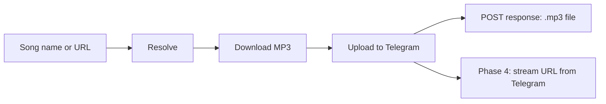

# Phase 2 — Implementation Plan

**Scope:** Download `.mp3` from Apple Music → **upload to Telegram** → return file directly for testing.

**Goal:** Verify resolve → download → Telegram upload. Temp stream URLs come in Phase 4.

---

## What Phase 2 is (and is not)

| Phase 2 IS | Phase 2 is NOT |
|------------|----------------|
| Download MP3 from aplmate | Temp stream URLs (Phase 4) |
| Upload to private Telegram channel | MongoDB / ingest API (Phase 3) |
| Return `.mp3` file directly on POST | Token-based local file cache |
| Testing playback + Telegram storage | Production stream delivery |

### Flow



**Phase 4** will issue temp stream URLs that read from Telegram — not from local disk.

---

## API contract

### POST `/api/v1/tracks/download`

1. Resolve (if needed)
2. Download MP3
3. Upload to Telegram channel
4. **Return the MP3 file** (`Content-Type: audio/mpeg`)

Response headers include Telegram refs for debugging:
- `X-Telegram-Chat-Id`
- `X-Telegram-Msg-Id`
- `X-Apple-Music-Url`

**No** `download_url` token. **No** GET file route.

Takes **10–30 seconds** — Swagger will show loading until complete.

---

## Implementation steps

### Step 1 — Dependencies

Add to `requirements.txt`: `beautifulsoup4`

Optional config in `app/config.py`:
- `DOWNLOAD_FILE_TTL` (default `900`) — temp file lifetime in seconds

### Step 2 — Exceptions

Add to `app/exceptions.py`:
- `DownloadError` — aplmate/CDN failure
- `MultiTrackError` — album/playlist URL (single track only in Phase 2)
- `FileNotReadyError` — download token expired

### Step 3 — Models

Add to `app/models/track.py`:
- `DownloadRequest` — `title` + optional `artist`, OR `apple_music_url`
- `DownloadResponse` — metadata + `download_url` + `expires_at`

### Step 4 — Port aplmate client

**New file:** `app/services/aplmate_client.py`

Port from `D:\Projects\Apple-Music-Bot-main\Apple-Music-Bot-main\ap.py`:
- `init_session`, `get_token`, `get_all_track_forms`, `get_links_for_track`
- Reject if more than 1 track form (`MultiTrackError`)

### Step 5 — Download helpers

**New file:** `app/services/download_utils.py`

Port from reference `apple.py`:
- `download_file`, `parse_filename`, `clean_song_name`, `sanitize_filename`, `split_links`

### Step 6 — Apple downloader service

**New file:** `app/services/apple_downloader.py`

```python
async def download_track(apple_music_url: str, tmp_dir: str) -> DownloadResult
```

Returns: `audio_path`, `thumb_path`, `title`, `filename`, `file_size`

### Step 7 — Temp file cache

**New file:** `app/services/download_cache.py`

In-memory token → local file path. Short TTL, cleanup on expiry.

**Temporary only** — Phase 3 replaces this with Telegram `{ chat_id, msg_id, hash }`.

### Step 8 — API routes

Extend `app/api/tracks.py`:
- `POST /tracks/download`
- `GET /tracks/download/file/{token}` → `FileResponse`

Wire cleanup task in `app/main.py` lifespan.

---

## Manual test checklist

- [ ] POST download with song name → JSON with `download_url`
- [ ] GET file route → valid `.mp3`, plays locally
- [ ] POST download with `apple_music_url` → same result
- [ ] Album/playlist URL → `422`
- [ ] Expired token → `404`

**PowerShell test:**

```powershell
$r = Invoke-RestMethod -Method POST -Uri "http://localhost:8000/api/v1/tracks/download" `
  -ContentType "application/json" `
  -Body '{"title":"Blinding Lights","artist":"The Weeknd"}'

Invoke-WebRequest -Uri "http://localhost:8000$($r.download_url)" -OutFile "test.mp3"
```

---

## Definition of done

Phase 2 is complete when:

1. Song name or Apple Music URL → downloadable `.mp3` file
2. File route works for testing playback
3. No Telegram, no stream URLs, no MongoDB

---

## What comes next

| Phase | Work |
|-------|------|
| **Phase 3** | Upload MP3 to private Telegram channel + MongoDB + `POST /ingest` |
| **Phase 4** | Temp **stream URLs** from Telegram storage + byte-range `/stream/{token}` |
| **Phase 5** | API keys, rate limits, Docker |

Phase 2 download route (`/download/file/{token}`) will be **removed or deprecated** once Phase 4 stream URLs are live.
