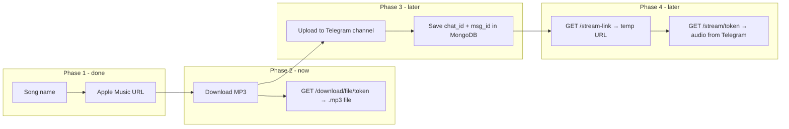

# Phase 2 — Implementation Plan

**Scope:** Download `.mp3` from Apple Music via aplmate.com — **for testing only**.

**Goal:** Verify the full resolve → download pipeline works before adding Telegram storage.

Reference: [PLAN.md](../PLAN.md) | Builds on: [PHASE1.md](./PHASE1.md)

---

## What Phase 2 is (and is not)

| Phase 2 IS | Phase 2 is NOT |
|------------|----------------|
| Download MP3 to local temp storage | Store files in Telegram |
| Return `.mp3` file via a download route | Generate temp stream URLs |
| Temporary test mechanism | Production playback delivery |
| Verify aplmate download works | MongoDB / ingest / dedup |

### How this fits the full product



**Final product:** Calling service gets a **temp stream URL** (1–2 hr TTL) that plays audio **from Telegram storage** (Phase 4).

**This phase:** Calling service gets a **file download URL** that returns the raw `.mp3` so we can test download quality and playback before wiring Telegram.

---

## Phase 2 deliverables

| # | Deliverable | Done when |
|---|-------------|-----------|
| 1 | Port aplmate client | Apple Music URL → CDN MP3 URL |
| 2 | Port download helpers | CDN URL → local `.mp3` file |
| 3 | `apple_downloader` service | `download_track(url)` returns file path + metadata |
| 4 | Temp file cache | Short-lived token → local file (replaced in Phase 3) |
| 5 | Download API | POST trigger + GET file route |
| 6 | Error handling | 404 / 422 / 502 for clear failure cases |

---

## Suggested commit order

```
1.  docs: add phase 2 implementation plan
2.  chore: add beautifulsoup4 dependency
3.  feat: add download-related exceptions
4.  feat: add download pydantic models
5.  feat: port aplmate client and link resolution
6.  feat: add mp3 file download helpers
7.  feat: add apple_downloader service
8.  feat: add in-memory download file cache
9.  feat: add tracks download and file routes
10. docs: update readme with phase 2 testing examples
```

Push after each commit.

---

## API contract

### POST `/api/v1/tracks/download`

Trigger resolve (if needed) + download. Returns metadata and a **file download URL** (not a stream link).

**Request (song name):**
```json
{ "title": "Blinding Lights", "artist": "The Weeknd" }
```

**Request (direct URL):**
```json
{ "apple_music_url": "https://music.apple.com/..." }
```

**Response 200:**
```json
{
  "title": "Blinding Lights",
  "artist": "The Weeknd",
  "filename": "Blinding Lights.mp3",
  "file_size": 5242880,
  "apple_track_id": 1499378106,
  "apple_music_url": "https://music.apple.com/...",
  "download_url": "/api/v1/tracks/download/file/abc123xyz",
  "expires_at": "2026-08-09T19:00:00Z"
}
```

### GET `/api/v1/tracks/download/file/{token}`

Returns the `.mp3` file (`Content-Type: audio/mpeg`).

- This is a **file download** for Phase 2 testing
- Token expires after ~15 min; temp file deleted
- **Not** the same as Phase 4 `/stream/{token}/{name}` which streams from Telegram

---

## Implementation steps

### Step 1 — Dependencies

Add to `requirements.txt`: `beautifulsoup4`

Optional config in `app/config.py`:
- `DOWNLOAD_FILE_TTL` (default `900`) — temp file lifetime in seconds

### Step 2 — Exceptions

Add to `app/exceptions.py`:
- `DownloadError` — aplmate/CDN failure
- `MultiTrackError` — album/playlist URL (single track only in Phase 2)
- `FileNotReadyError` — download token expired

### Step 3 — Models

Add to `app/models/track.py`:
- `DownloadRequest` — `title` + optional `artist`, OR `apple_music_url`
- `DownloadResponse` — metadata + `download_url` + `expires_at`

### Step 4 — Port aplmate client

**New file:** `app/services/aplmate_client.py`

Port from `D:\Projects\Apple-Music-Bot-main\Apple-Music-Bot-main\ap.py`:
- `init_session`, `get_token`, `get_all_track_forms`, `get_links_for_track`
- Reject if more than 1 track form (`MultiTrackError`)

### Step 5 — Download helpers

**New file:** `app/services/download_utils.py`

Port from reference `apple.py`:
- `download_file`, `parse_filename`, `clean_song_name`, `sanitize_filename`, `split_links`

### Step 6 — Apple downloader service

**New file:** `app/services/apple_downloader.py`

```python
async def download_track(apple_music_url: str, tmp_dir: str) -> DownloadResult
```

Returns: `audio_path`, `thumb_path`, `title`, `filename`, `file_size`

### Step 7 — Temp file cache

**New file:** `app/services/download_cache.py`

In-memory token → local file path. Short TTL, cleanup on expiry.

**Temporary only** — Phase 3 replaces this with Telegram `{ chat_id, msg_id, hash }`.

### Step 8 — API routes

Extend `app/api/tracks.py`:
- `POST /tracks/download`
- `GET /tracks/download/file/{token}` → `FileResponse`

Wire cleanup task in `app/main.py` lifespan.

---

## Manual test checklist

- [ ] POST download with song name → JSON with `download_url`
- [ ] GET file route → valid `.mp3`, plays locally
- [ ] POST download with `apple_music_url` → same result
- [ ] Album/playlist URL → `422`
- [ ] Expired token → `404`

**PowerShell test:**

```powershell
$r = Invoke-RestMethod -Method POST -Uri "http://localhost:8000/api/v1/tracks/download" `
  -ContentType "application/json" `
  -Body '{"title":"Blinding Lights","artist":"The Weeknd"}'

Invoke-WebRequest -Uri "http://localhost:8000$($r.download_url)" -OutFile "test.mp3"
```

---

## Definition of done

Phase 2 is complete when:

1. Song name or Apple Music URL → downloadable `.mp3` file
2. File route works for testing playback
3. No Telegram, no stream URLs, no MongoDB

---

## What comes next

| Phase | Work |
|-------|------|
| **Phase 3** | Upload MP3 to private Telegram channel + MongoDB + `POST /ingest` |
| **Phase 4** | Temp **stream URLs** from Telegram storage + byte-range `/stream/{token}` |
| **Phase 5** | API keys, rate limits, Docker |

Phase 2 download route (`/download/file/{token}`) will be **removed or deprecated** once Phase 4 stream URLs are live.
